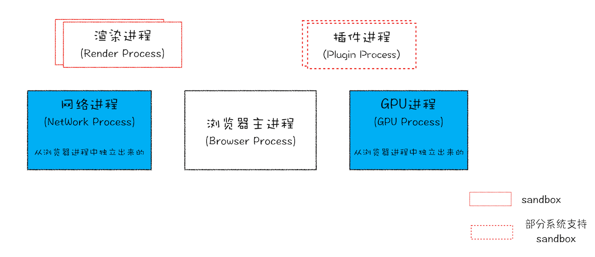

## 线程和进程

> 进程（process）和线程（thread）是操作系统的基本概念

进程是 CPU 资源分配的最小单位（是能拥有资源和独立运行的最小单位） 
线程是 CPU 调度的最小单位（是建立在进程基础上的一次程序运行单位） 

**一个进程就是一个程序的运行实例**：启动一个程序时，操作系统会为该程序创建一块内存，用来存放代码、运行中的数据和一个执行任务的主线程，我们把这样的一个运行环境叫**进程**

**线程是进程内的一个执行单元**：线程是不能单独存在的，是依附于进程并由进程来启动和管理的

::: tip 进程和线程的关系特点

- 进程是拥有资源的基本单位；线程是调度和分配的基本单位（是进程内的一个执行单元，也是进程内的可调度实体）
- 进程之间相互隔离，互不干扰
- 一个进程中可以并发执行多个线程
- 一个线程只能隶属于一个进程，而一个进程是可以拥有多个线程的（但至少有一个主线程）
- 同一进程的所有线程共享该进程的所有数据
- 进程中的任意一线程执行出错，都会导致整个进程的崩溃
- 当一个进程关闭之后，操作系统会回收进程所占用的内存

:::

### Chrome 打开一个页面会有几个进程？

> 最新的 Chrome 多进程架构图

- **浏览器主进程**：负责界面显示、用户交互、子进程管理，同时提供存储等功能
- **渲染进程**：负责将 `HTML` `CSS` 和 `JavaScript` 转换为用户可以与之交互的网页
  - 排版引擎 Blink 和 JavaScript 引擎 V8 都是运行在该进程中
  - 默认情况下 Chrome 会为每个 Tab 标签创建一个渲染进程
  - 出于安全考虑渲染进程都是运行在沙箱模式下
- **GPU 进程**：负责网页、Chrome 的 UI 界面的绘制
- **网络进程**：负责页面的网络资源加载（之前是作为一个模块运行在浏览器进程）
- **插件进程**：负责插件的运行（因为插件易崩溃所以需要通过插件进程来隔离，以保证插件崩溃不会对浏览器和页面造成影响）

[Chrome 架构：仅仅打开了 1 个页面，为什么有 4 个进程？—— 浏览器工作原理与实践](https://time.geekbang.org/column/article/113513)

