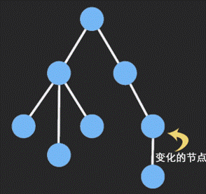

# immutable.js 不可变数据集合

在上一个小节中，我们对数组进行了浅拷贝处理，这样可以防止直接修改数组的引用地址。但是对于深层次的对象就不行了，需要进行深拷贝处理。

但是常见的深拷贝处理机制，对于性能或功能性上都有一定的制约性，所以不复杂的数据，我们直接就可以选择用`lodash`库中提供的深拷贝方法处理就可以了。但是对于复杂的对象就需要拷贝性能问题，这就可以用到本小节中介绍的 immutable.js 不可变数据集合。

## immutable.js 库

Immutable 是 Facebook 开发的不可变数据集合。不可变数据一旦创建就不能被修改，使得应用开发更简单，允许使用函数式编程技术，比如惰性评估。Immutable JS 提供一个惰性 `Sequence，`允许高效的队列方法链，类似 `map` 和 `filter` ，不用创建中间代表。

具体是如何做到高效的，可以参考图示。

<div align=center>
    
    <div>immutablejs</div>
</div>

下面就来看一下 immutable.js 的基本使用吧，代码如下：

```jsx
import Immutable from "immutable";

class Head extends React.PureComponent {
  render() {
    console.log("render");
    return <div>head component, {this.props.item.get("text")} </div>;
  }
}
class Welcome extends React.PureComponent {
  state = {
    msg: "hello",
    count: 0,
    list: Immutable.fromJS([{ id: 1, text: "aaa" }]),
  };
  handleClick = () => {
    let list = this.state.list.setIn([0, "text"], "bbb");
    this.setState({
      list,
    });
  };
  render() {
    return (
      <div>
        <button onClick={this.handleClick}>点击</button>
        <Head item={this.state.list.get(0)} />
      </div>
    );
  }
}
```

主要就是通过 Immutable.fromJS()先把对象转成 immutable 对象，再通过 setIn()方法来设置数据，get()方法来获取数据。
