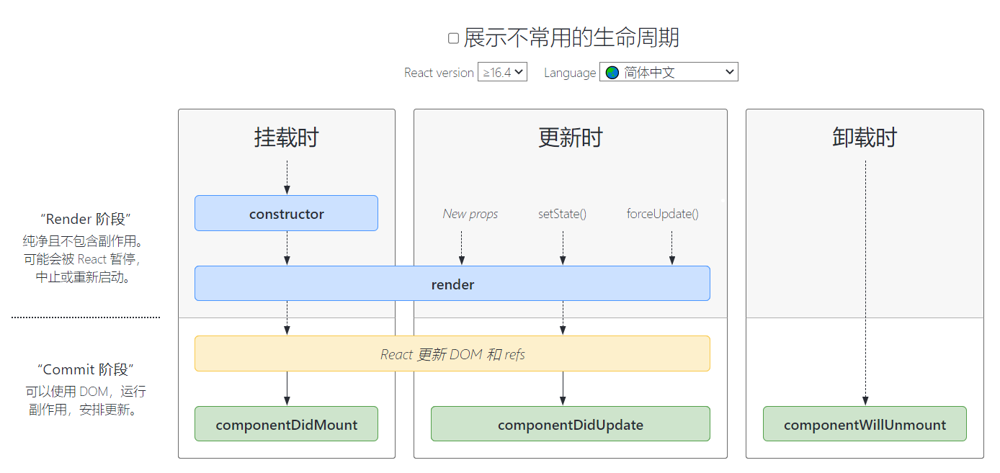

# 详解常见生命周期钩子函数

在学习 Vue 的时候，我们就已经介绍了生命周期钩子函数的概念，React 中也存在一些钩子函数。我们可以为类组件声明一些特殊的方法，当组件挂载、更新或卸载时就会去执行这些函数。

要想学习 React 类组件的生命周期钩子函数，可以参考生命周期图谱。地址：https://projects.wojtekmaj.pl/react-lifecycle-methods-diagram/

<div align=center>
    
    <div>常见生命周期图谱</div>
</div>

生命周期主要分为三个阶段：

- 挂载时
- 更新时
- 卸载时

挂载时对应的钩子函数有：`constructor`，`render`，`componentDidMount`。

更新时对应的钩子函数有：`render`，`componentDidUpdate`

卸载时对应的钩子函数有：`componentWillUnmount`

可以看到挂载时和更新时都有`render`这个方法。这就是为什么 state 改变的时候，会触发`render`重渲染操作。

```jsx
class Welcome extends React.Component {
  state = {
    msg: "hello world",
  };
  constructor(props) {
    super(props);
    console.log("constructor");
  }
  componentDidMount = () => {
    // react中发起ajax请求的初始操作，在这个钩子中完成
    console.log("componentDidMount");
  };
  componentDidUpdate = () => {
    // 等DOM更新后触发的钩子
    console.log("componentDidUpdate");
  };
  componentWillUnmount = () => {
    console.log("componentWillUnmount");
  };
  handleClick = () => {
    /* this.setState({
          msg: 'hi react'
        }); */
    //this.forceUpdate();
    root.unmount(); // 触发卸载组件
  };
  render() {
    console.log("render");
    return (
      <div>
        <button onClick={this.handleClick}>点击</button>
        {this.state.msg}
      </div>
    );
  }
}
```
