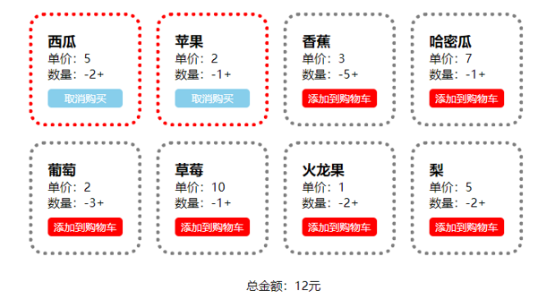

# 简易购物车的综合案例

利用本章所学习的 React 类组件知识，一起来完成一个简易的购物车效果，案例如下所示。

<div align=center>
    
    <div>简易购物车效果</div>
</div>

这个效果首先准备了对应的 json 数据，然后再去拆分组件，最后实现逻辑的部分，代码如下：

```json
{
    "errcode": 0,
    "list": [
        {
            "id": 1,
            "isActive": false,
            "name": "西瓜",
            "price": 5,
            "number": 2
        },
        ...
    ]
}
```

```jsx
<!DOCTYPE html>
<html lang="en">
<head>
  <meta charset="UTF-8">
  <meta http-equiv="X-UA-Compatible" content="IE=edge">
  <meta name="viewport" content="width=device-width, initial-scale=1.0">
  <title>Document</title>
  <style>
    *{margin: 0; padding: 0;}
    li{ list-style: none;}
    .cart{ width: 700px; margin: 30px auto;}
    ul{ overflow: hidden;}
    li{ width: 100px; border: 5px gray dotted; border-radius: 20px; padding: 20px; float: left; margin:10px;}
    .remove, .add{ cursor: pointer;}
    .cartbtn{ font-size:14px; text-align: center; background: red; color: white; padding: 3px; border-radius: 5px; margin-top: 10px; cursor: pointer;}
    li.active{ border-color:red;}
    li.active .cartbtn{ background-color: skyblue;}
    .all{ text-align: center; margin: 20px 0;}
  </style>
  <script src="../react.development.js"></script>
  <script src="../react-dom.development.js"></script>
  <script src="../babel.min.js"></script>
  <script src="../lodash.min.js"></script>
</head>
<body>
  <div id="app"></div>
  <script type="text/babel">
    let app = document.querySelector('#app');
    let root = ReactDOM.createRoot(app);
    class Cart extends React.PureComponent {
      state = {
        list: [],
        all: 0
      }
      componentDidMount = () => {
        fetch('./data.json').then((res)=>{
          return res.json();
        }).then((res)=>{
          if(res.errcode === 0){
            this.setState({
              list: res.list
            });
          }
        })
      }
      componentDidUpdate = () => {
        this.computedAll()
      }
      handleAdd = (id) => {
        return () => {
          let list = _.cloneDeep(this.state.list)
          let now = list.find((v)=> v.id === id)
          now.number++;
          this.setState({
            list
          });
        }
      }
      handleRemove = (id) => {
        return () => {
          let list = _.cloneDeep(this.state.list)
          let now = list.find((v)=> v.id === id)
          if( now.number > 1 ){
            now.number--;
          }
          this.setState({
            list
          });
        }
      }
      handleCartBtn = (id) => {
        return () => {
          let list = _.cloneDeep(this.state.list)
          let now = list.find((v)=> v.id === id)
          now.isActive = !now.isActive
          this.setState({
            list
          });
        }
      }
      computedAll = () => {
        let all = 0;
        this.state.list.filter((v)=> v.isActive).forEach((v)=>{
          all += v.price * v.number;
        })
        this.setState({
          all
        });
      }
      render(){
        return (
          <div className="cart">
            <ul>
              {
                this.state.list.map((v)=> <Item key={v.id} {...v} handleAdd={this.handleAdd} handleRemove={this.handleRemove} handleCartBtn={this.handleCartBtn} />)
              }

            </ul>
            <div className="all">
              总金额：<span>{ this.state.all }</span>元
            </div>
          </div>
        );
      }
    }
    class Item extends React.PureComponent {
      render(){
        const { id, isActive, name, price, number, handleAdd, handleRemove, handleCartBtn } = this.props;
        return (
          <li className={ isActive ? 'active' : '' }>
            <h3>{name}</h3>
            <p>单价：{price}</p>
            <p>
              数量：
              <span className="remove" onClick={handleRemove(id)}>-</span>
              <span>{number}</span>
              <span className="add" onClick={handleAdd(id)}>+</span>
            </p>
            <div className="cartbtn" onClick={handleCartBtn(id)}>{  isActive ? '取消购买' : '添加到购物车'  }</div>
          </li>
        );
      }
    }
    let element = (
      <Cart />
    );
    root.render(element)
  </script>
</body>
</html>
```
