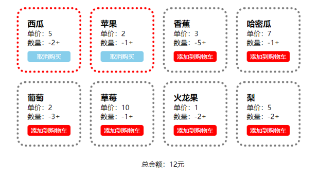

# 简易购物车的 Hook 版本

利用本章所学习的 React 类组件知识，一起来完成一个简易的购物车效果，案例如下所示。

<div align=center>
    
    <div>简易购物车效果</div>
</div>

这个效果首先准备了对应的 json 数据，然后再去拆分组件，最后实现逻辑的部分，代码如下：

```html
<!DOCTYPE html>
<html lang="en">
  <head>
    <meta charset="UTF-8" />
    <meta http-equiv="X-UA-Compatible" content="IE=edge" />
    <meta name="viewport" content="width=device-width, initial-scale=1.0" />
    <title>Document</title>
    <style>
      * {
        margin: 0;
        padding: 0;
      }
      li {
        list-style: none;
      }
      .cart {
        width: 700px;
        margin: 30px auto;
      }
      ul {
        overflow: hidden;
      }
      li {
        width: 100px;
        border: 5px gray dotted;
        border-radius: 20px;
        padding: 20px;
        float: left;
        margin: 10px;
      }
      .remove,
      .add {
        cursor: pointer;
      }
      .cartbtn {
        font-size: 14px;
        text-align: center;
        background: red;
        color: white;
        padding: 3px;
        border-radius: 5px;
        margin-top: 10px;
        cursor: pointer;
      }
      li.active {
        border-color: red;
      }
      li.active .cartbtn {
        background-color: skyblue;
      }
      .all {
        text-align: center;
        margin: 20px 0;
      }
    </style>
    <script src="../react.development.js"></script>
    <script src="../react-dom.development.js"></script>
    <script src="../babel.min.js"></script>
    <script src="../lodash.min.js"></script>
  </head>
  <body>
    <div id="app"></div>
    <script type="text/babel">
      let app = document.querySelector("#app");
      let root = ReactDOM.createRoot(app);
      let { useState, useEffect } = React;
      let Cart = () => {
        const [list, setList] = useState([]);
        const [all, setAll] = useState(0);
        useEffect(() => {
          fetch("./data.json")
            .then((res) => {
              return res.json();
            })
            .then((res) => {
              if (res.errcode === 0) {
                setList(res.list);
              }
            });
        }, []);
        useEffect(() => {
          computedAll();
        }, [list]);

        const handleAdd = (id) => {
          return () => {
            let cloneList = _.cloneDeep(list);
            let now = cloneList.find((v) => v.id === id);
            now.number++;
            setList(cloneList);
          };
        };
        const handleRemove = (id) => {
          return () => {
            let cloneList = _.cloneDeep(list);
            let now = cloneList.find((v) => v.id === id);
            if (now.number > 1) {
              now.number--;
            }
            setList(cloneList);
          };
        };
        const handleToCart = (id) => {
          return () => {
            let cloneList = _.cloneDeep(list);
            let now = cloneList.find((v) => v.id === id);
            now.isActive = !now.isActive;
            setList(cloneList);
          };
        };
        const computedAll = () => {
          let all = 0;
          list
            .filter((v) => v.isActive)
            .forEach((v) => {
              all += v.price * v.number;
            });
          setAll(all);
        };
        return (
          <div className="cart">
            <ul>
              {list.map((v) => (
                <Item
                  key={v.id}
                  {...v}
                  handleAdd={handleAdd}
                  handleRemove={handleRemove}
                  handleToCart={handleToCart}
                />
              ))}
            </ul>
            <div className="all">
              总金额：<span>{all}</span>元
            </div>
          </div>
        );
      };
      let Item = (props) => {
        const {
          id,
          name,
          isActive,
          price,
          number,
          handleAdd,
          handleRemove,
          handleToCart,
        } = props;
        return (
          <li className={isActive ? "active" : ""}>
            <h3>{name}</h3>
            <p>单价：{price}</p>
            <p>
              数量：
              <span className="remove" onClick={handleRemove(id)}>
                -
              </span>
              <span>{number}</span>
              <span className="add" onClick={handleAdd(id)}>
                +
              </span>
            </p>
            <div className="cartbtn" onClick={handleToCart(id)}>
              {" "}
              {isActive ? "取消购买" : "添加到购物车"}{" "}
            </div>
          </li>
        );
      };
      let element = <Cart />;
      root.render(element);
    </script>
  </body>
</html>
```
